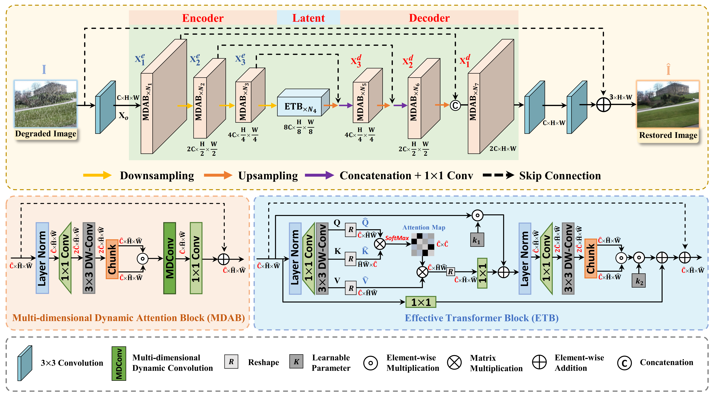

# :fire: Joint multi-dimensional dynamic attention and transformer for general image restoration (CVIU'2025)

> [[CVIU](https://www.sciencedirect.com/science/article/abs/pii/S1077314225002140)] &emsp; [[arxiv](https://arxiv.org/abs/2408.15994)]

This is the official PyTorch codes for the paper:

>**Joint multi-dimensional dynamic attention and transformer for general image restoration**<br>
[Huan Zhang<sup>1</sup>](https://house-yuyu.github.io/), [Xu Zhang<sup>2📧</sup>](https://house-yuyu.github.io/), [Nian Cai<sup>1📧</sup>](https://scholar.google.com.hk/citations?hl=zh-CN&user=hxDRrEQAAAAJ&hl=zh-CN), [Jianglei Di<sup>1</sup>](https://scholar.google.com.hk/citations?user=QlJKQxEAAAAJ&hl=zh-CN), [Yun Zhang<sup>3</sup>](https://scholar.google.com.hk/citations?user=tZp-uVoAAAAJ&hl=zh-CN)<br>
> <sup>1</sup> Guangdong University of Technology <sup>2</sup> Wuhan University <sup>3</sup> Sun Yat-sen University<br>
> <sup>📧</sup> Corresponding author




:star: If MDDA-former is helpful to your images or projects, please help star this repo. Thank you! :point_left:


## :book: Citation

If you find our repo useful for your research, please consider citing our paper:

```bibtex
@article{MDDAformer,
title = {Joint multi-dimensional dynamic attention and transformer for general image restoration},
journal = {Computer Vision and Image Understanding},
volume = {261},
pages = {104491},
year = {2025}}
```

## :postbox: Contact

If you have any questions, please feel free to reach us out at <a href="zhangx0802@whu.edu.cn">zhangx0802@whu.edu.cn</a>.

